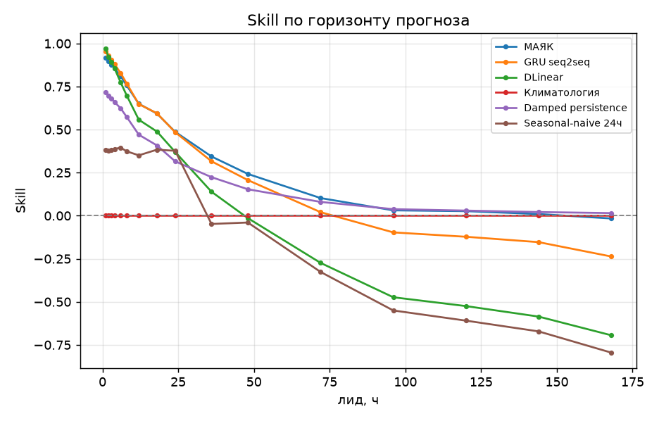
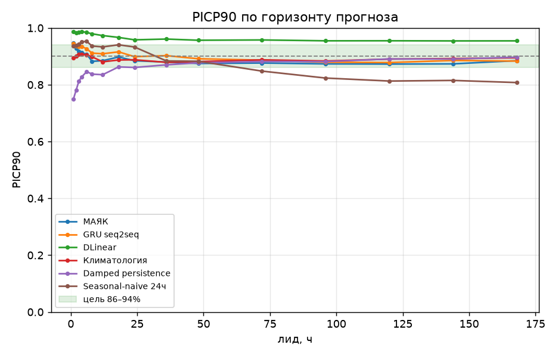
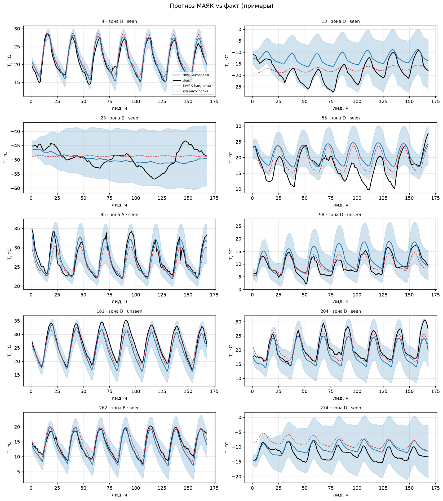
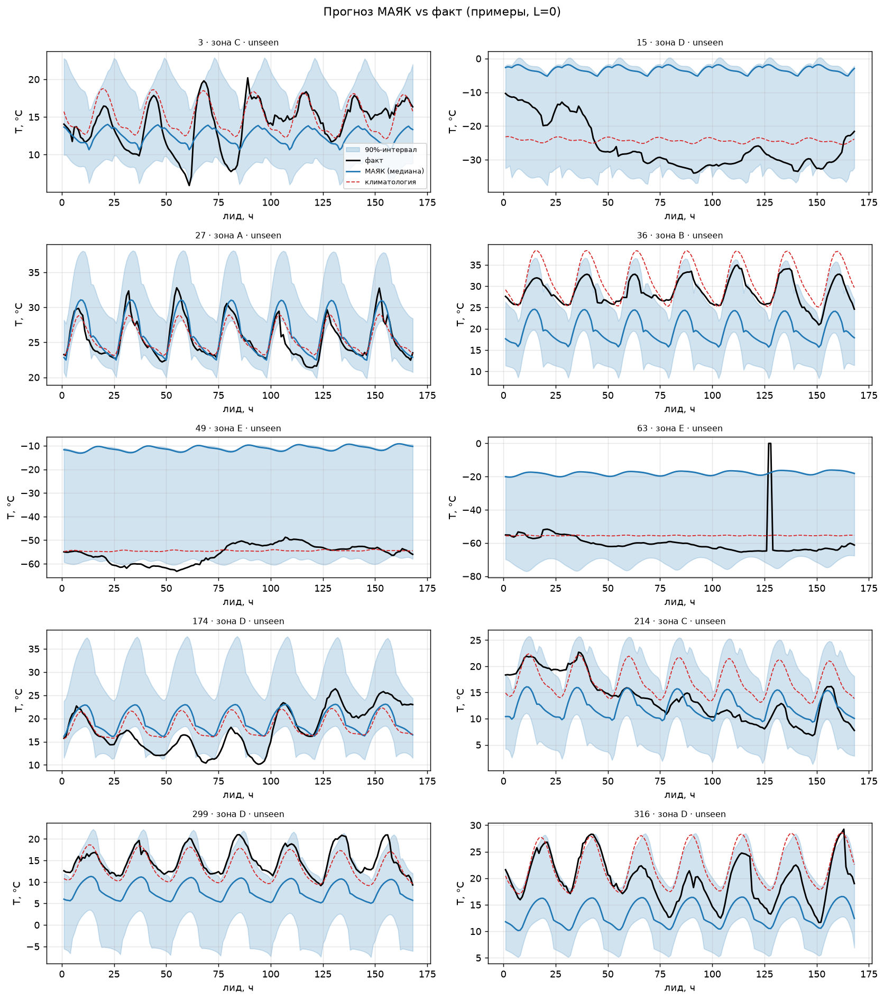
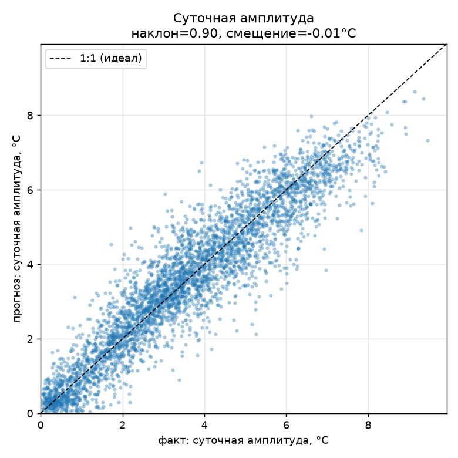
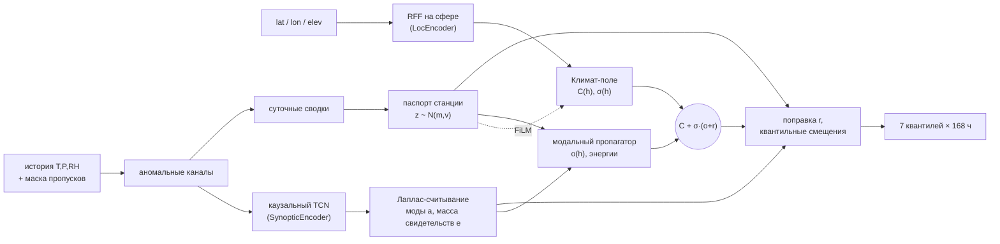

<h1 align="center">МАЯК</h1>
<p align="center">
  <b>Калиброванный вероятностный прогноз приземной температуры на 168 часов — из одной метеостанции, с работой на устройстве в режиме O(1)/час.</b>
</p>
<p align="center">
  
  
  
</p>

---

МАЯК берёт историю наблюдений одной точки (температура, давление, влажность + маска пропусков) и выдаёт прогноз на 7 суток вперёд **в виде 7 квантилей** на каждый из 168 часов — то есть не точку, а честный интервал неопределённости. Модель компактная, привязана к физике (солнечная геометрия, климатология, затухающая память), переживает пропуски и холодный старт, обобщается на **новые станции, которых не было в обучении**, и разворачивается на железе уровня Raspberry Pi с состоянием < 4 КБ.

> **Данные не входят в репозиторий.** Модель обучается на почасовых рядах (мы берём их из [Open-Meteo](https://open-meteo.com/)). Скачивание и подготовку данных пользователь выполняет сам — см. [Данные](#-данные).

## TL;DR

- **Горизонт:** 1–168 ч, шаг 1 ч. **Выход:** квантили `{5, 10, 25, 50, 75, 90, 95}%`.
- **Калибровка:** 90%-интервал реально накрывает ~88–90% случаев на всех горизонтах (сплит-конформная доводка).
- **Никогда не хуже климатологии:** на дальних лидах прогноз структурно сходится к климату (Skill@168 ≈ 0), а не уходит в минус.
- **Холодный старт безопасен:** без истории прогноз = климатология с широкими интервалами; с 6 ч данных восстанавливается до ~90% полного качества.
- **Обобщение на новые точки:** на станциях, не виденных при обучении, качество не падает (паспорт станции добирает локальный сдвиг из истории).
- **На устройстве:** точный потоковый эквивалент пакетной модели, `O(M)` на новый час, состояние < 4 КБ, переживает перезагрузку.

---

## 📊 Результаты

Сравнение на тесте (Skill — снижение MSE относительно климатологии; `PICP90` — фактическое покрытие 90%-интервала).

| лид | МАЯК Skill | GRU seq2seq | DLinear | Damped persist. | МАЯК PICP90 |
|----:|:----------:|:-----------:|:-------:|:---------------:|:-----------:|
| 1 ч  | **+91.6%** | +95.3% | +97.1% | +71.6% | 94.6% |
| 6 ч  | **+81.0%** | +82.8% | +77.4% | +62.4% | 90.7% |
| 24 ч | **+48.7%** | +48.5% | +37.0% | +31.6% | 88.4% |
| 72 ч | **+10.2%** | +2.1%  | −27.4% | +8.0%  | 87.6% |
| 168 ч| **−1.6%**  | −23.7% | −69.4% | +1.5%  | 88.5% |

На сверхкоротком горизонте (1–6 ч) свободные модели (GRU/DLinear) чуть гибче. С 24 ч и далее МАЯК уверенно лидирует среди обучаемых моделей и, в отличие от них, **не проваливается ниже климатологии** на дальних лидах (DLinear к 168 ч даёт −69%). По вероятностным метрикам (CRPS, Winkler) МАЯК — лучший почти на всём горизонте. Климатология везде по определению = 0%.

**Дополнительно (на тестовых данных):**
- vs Damped persistence @24 ч: **+48.7% против +31.6%** (запас +17 п.п.).
- Обобщение: Skill@24 ч **+47.8% (seen) / +54.1% (unseen)** — на новых станциях не хуже.
- Холодный старт: доля от полного качества при 24 ч истории — **94%** (цель ≥ 80%).
- Калибровка: `PICP90 ∈ [87.5%, 94.6%]` по всем лидам; после конформной доводки — ~90% во всех бинах без потери остроты.

<details>
<summary><b>Графики (по горизонту, примеры прогнозов, калибровка)</b></summary>

<br>

**Skill и калибровка по горизонту** — МАЯК (синий) против бейзлайнов:

<p align="center">
  
  
</p>

**Примеры «прогноз vs факт»** (медиана + 90%-интервал; чёрное — факт, красное пунктиром — климатология):

<p align="center"></p>

**Холодный старт (`L=0`, новые станции).** Без истории медиана = климат-поле, а интервал честно широкий — модель не «уверенно ошибается», а сообщает незнание:

<p align="center"></p>

**Суточная амплитуда: прогноз vs факт** (наклон ≈ 0.90 — лёгкое демпфирование дневного хода):

<p align="center"></p>

</details>

---

## 🧠 Как это работает

В основе — **разложение прогноза на «якорь + аномалия»**:

```
T̂(t+h) = C(h)  +  σ(h) · ( o(h) + r(h) )
         ╰─ климат ─╯      ╰─ отклонение от климата ─╯
```

- `C(h)`, `σ(h)` — климатическое среднее и масштаб разброса в точке (из неявного климат-поля);
- `o(h)` — отклонение, собранное из **затухающих мод** памяти наблюдений (моментально → ноль при отсутствии данных);
- `r(h)` — ограниченная нелинейная поправка.

Так структурно гарантируется главное свойство: **нет данных или дальний горизонт → аномалия затухает → прогноз = климатология** (а не произвольный дрейф). Квантили строятся вокруг медианы монотонными смещениями `σ·ratio·offset`.



<details>
<summary><b>Компоненты (по файлам)</b></summary>

<br>

| Модуль | Файл | Роль |
|---|---|---|
| **LocEncoder** | `mayak/modules/loc.py` | Случайные Фурье-признаки точки на сфере (полосо-ограниченные) + широта/высота → гладкий координатный вход. |
| **ClimateField** | `mayak/modules/field.py` | Координаты → коэффициенты годового×суточного гармонического базиса → климат `C, σ, ΔТ_сут`. Модулируется паспортом через FiLM (ограниченный, ±30%). |
| **Fingerprint (паспорт)** | `mayak/modules/passport.py` | Латент станции `z ~ N(m,v)`. Глобальный прайор + байесовское обновление по суточным сводкам (GRU). При нулевой истории `z = m₀` (нейтрально), с данными — добирает локальный сдвиг. |
| **SynopticEncoder** | `mayak/modules/encoder.py` | Каузальный TCN (12 depthwise-separable блоков с растущей дилатацией). |
| **LaplaceReadout** | `mayak/modules/readout.py` | 24 затухающие моды (релакс./суточные/полусуточные/синоптические) с полюсами `λ = −1/τ + iω`. Замкнутая форма + точный потоковый шаг `O(M)`. Деление на `e + κ` = «доказательное сжатие» к нулю при короткой истории. |
| **ModalPropagator** | `mayak/modules/propagator.py` | Разворачивает состояние мод на 168 ч (затухание + поворот фазы), с подстройкой `τ, ω` под станцию. |
| **Heads** | `mayak/modules/heads.py` | Ограниченная поправка `r = 0.6·tanh(...)`, масштаб интервала и монотонные квантильные смещения. |
| **Сборка** | `mayak/model.py` | Прямой проход + smoke-тест (включая проверку тождества «пакет = поток» на 672 шагах). |

</details>

<details>
<summary><b>Обучение и калибровка</b></summary>

<br>

- **Лосс** (`mayak/loss.py`): pinball по 7 квантилям в аномальной шкале (нормировка на `σ` уравнивает вклад разных климатов) + регуляризаторы: KL паспорта, энергия мод, якорь интервала и затухание поправки при «мёртвой» энергии.
- **Два этапа** (`scripts/train.py`): **A** — только `L=0` (стабилизация климат-поля; выбор лучшего поля по unseen-валидации), **B** — полный куррикулум длин истории. EMA весов; валидация на отложенных станциях.
- **Конформная доводка** (`scripts/calibrate.py`): сплит-конформная коррекция квантилей по бинам лидов на отдельном калибровочном периоде. Подтягивает покрытие к номиналу, не трогая точечный прогноз; на устройстве применяется тем же таблицей сдвигов.
- **Бейзлайны** (`mayak/baselines.py`): климатология, damped persistence, seasonal-naive, GRU seq2seq, DLinear — обучаются тем же бюджетом и оцениваются на тех же окнах.

</details>

---

## 🚀 Установка

```bash
git clone https://github.com/feyra-labs/tempcast.git
cd tempcast
python -m venv .venv && source .venv/bin/activate
pip install -e .            # или: pip install -r requirements.txt
```
Зависимости: `torch`, `pytorch-lightning`, `numpy`, `pandas`, `matplotlib` (+ `onnx`/`onnxruntime` для экспорта на устройство).

---

## 🌍 Данные

Данные **не поставляются**. Подготовьте свои почасовые ряды (мы используем Open-Meteo: температура 2 м, приземное давление, относительная влажность):

1. Скачайте часовые ряды по нужным станциям/точкам.
2. Соберите `data/manifest.csv` со столбцами как минимум: `station_id, lat, lon, elev, split` (`split ∈ {train, unseen_val, unseen_test}` — **разбиение по станциям**, чтобы честно мерить обобщение на новые точки).
3. Сложите ряды по станциям в формат, который читает загрузчик (`tempcast/data/…`): почасовые `T, P, RH` + маска валидности.

> Для быстрой проверки конвейера есть синтетический генератор (`scripts/make_synth.py`) — он даёт игрушечные, но реалистичные ряды, на которых всё запускается за минуты.

---

## 🛠 Использование

### Обучение

```bash
# (опц.) демо-данные для smoke-прогона
python scripts/make_synth.py
python scripts/make_splits.py --manifest data/manifest.csv

# двухэтапное обучение МАЯК
python scripts/train.py --manifest data/manifest.csv \
    --steps-a 20000 --steps-b 200000 --batch 256 \
    --accelerator gpu --precision 32

# (опц.) нейробейзлайны для сравнения
python scripts/train_baselines.py --models gru dlinear --steps 200000
```
Лучшие чекпойнты сохраняются в `runs/stageB/best.ckpt` (и `runs/baseline_*`).

### Оценка и воспроизведение графиков

```bash
# конформная таблица (калибровка интервалов)
python scripts/calibrate.py --ckpt runs/stageB/best.ckpt --out runs/conformal.npy

# полный отчёт: таблицы метрик, графики по горизонту, примеры прогнозов,
# разрез по климатическим зонам, холодный старт, влияние калибровки
python mayak/evaluate_ext.py --ckpt runs/stageB/best.ckpt \
    --gru-ckpt runs/baseline_gru/best.ckpt \
    --dlinear-ckpt runs/baseline_dlinear/best.ckpt \
    --conformal runs/conformal.npy --out-dir assets
```

<details>
<summary><b>Диагностика модели (knockout-абляции)</b></summary>

<br>

Понять вклад каждого компонента в **уже обученной** модели, без переобучения:
```bash
python mayak/knockout.py --ckpt runs/stageB/best.ckpt
```
Выключает по очереди солнечные каналы, группы мод, паспорт и т.д. через forward-hooks и печатает падение Skill по лидам.
</details>

### Инференс на устройстве

```bash
# экспорт (ONNX/int8 + копия конформной таблицы рядом с моделью)
python scripts/export_onnx.py --ckpt runs/stageB/best.ckpt --out runtime/mayak.onnx

# потоковый инференс: восстановление состояния → почасовые шаги → выпуск прогноза
python runtime/run_inference.py --ckpt runs/stageB/best.ckpt \
    --conformal runs/conformal.npy --lat 52.37 --lon 4.90 --elev -2
```
Потоковый рантайм (`runtime/streaming.py`) обновляет состояние за `O(M)` на новый час, переживает перезагрузку (сериализация < 4 КБ), при отказе датчиков плавно деградирует к климатологии (watchdog-фолбэк). Требуются **координаты точки и часы UTC** — без них солнечная геометрия не определена.

---

<details>
<summary><b>📁 Структура репозитория</b></summary>

<br>

```
mayak/
  modules/        loc, field, passport, encoder, readout, propagator, heads
  model.py        сборка MAYAK + smoke-тест
  astro.py        солнечно-календарные признаки, точка росы
  loss.py         pinball + регуляризаторы
  lit.py          LightningModule (МАЯК и бейзлайны), EMA
  baselines.py    климатология / damped / seasonal / GRU / DLinear
  data/           загрузчик, окна, суточные сводки, сплиты
  evaluate_ext.py метрики, графики, разрез по зонам, холодный старт
  knockout.py     абляции обученной модели (без переобучения)
scripts/          make_synth, make_splits, train, train_baselines, calibrate, export_onnx
runtime/          streaming.py (потоковый рантайм), run_inference.py
```
</details>

## ⚠️ Область применения и ограничения

- **Цель** — приземная температура из одной точки. Это не замена численному прогнозу погоды: синоптику «сбоку» (приходящие фронты) одна станция не видит, поэтому **на дальних лидах прогноз честно сходится к климатологии** (Skill ≈ 0) — это предел предсказуемости, а не недоработка.
- **Поле грубое** по построению (масштаб крупнее расстояния между станциями); тонкий локальный климат новой точки восстанавливается **из истории** паспортом, а не из координат. На совсем новой точке при нулевой истории прогноз = климатология с широкими интервалами.
- Нужны **корректные координаты и время UTC**. Обучено и проверено на почасовых данных Open-Meteo.

## Лицензия

MIT — см. [`LICENSE`](LICENSE).
