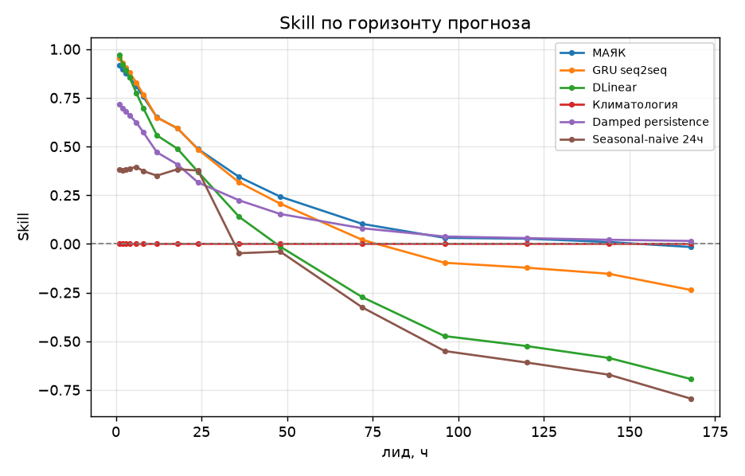
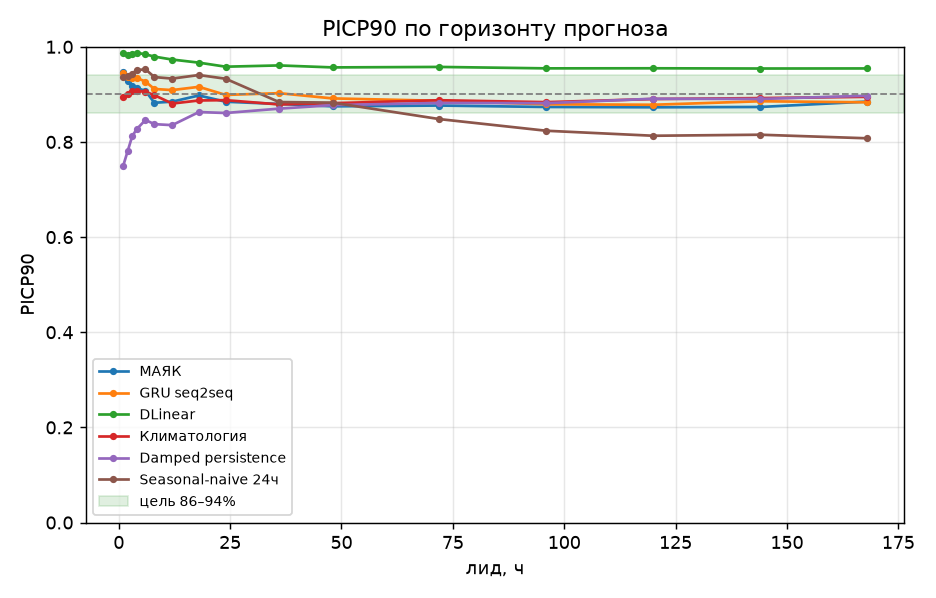
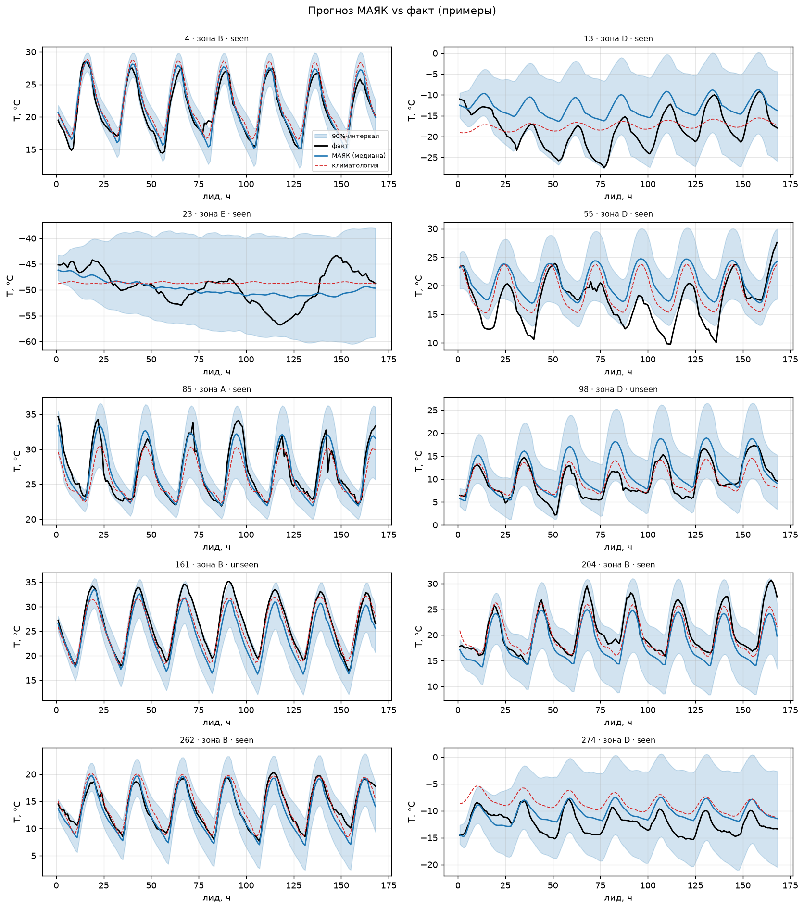
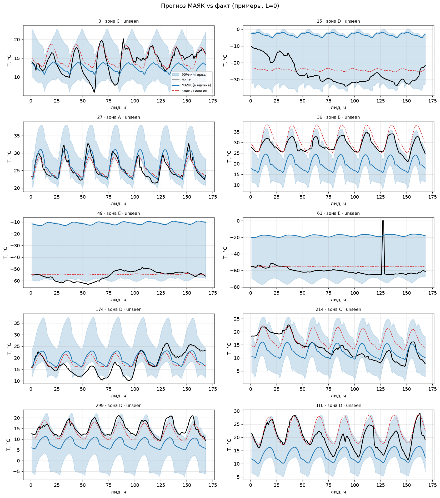
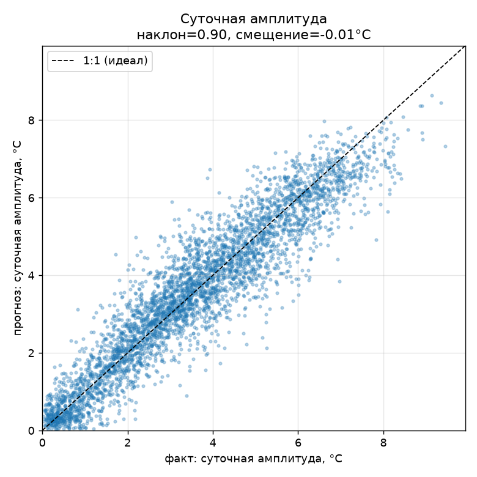
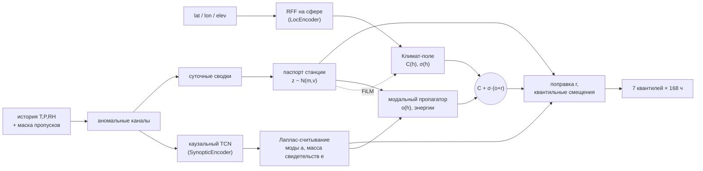

<h1 align="center">МАЯК</h1>
<p align="center">
  <b>Калиброванный вероятностный прогноз приземной температуры на 168 часов — из одной метеостанции, с работой на устройстве в режиме O(M)/час.</b>
</p>
<p align="center">
  
  
  
</p>

---

МАЯК берёт историю наблюдений одной точки (температура, давление, влажность + маска пропусков) и выдаёт прогноз на 7 суток вперёд **в виде 7 квантилей** на каждый из 168 часов — то есть не точку, а честный интервал неопределённости. Модель компактная, привязана к физике (солнечная геометрия, климатология, затухающая память), переживает пропуски и холодный старт, обобщается на **новые станции, которых не было в обучении**, и разворачивается на железе уровня Raspberry Pi с состоянием < 4 КБ.

> **Данные не входят в репозиторий.** Модель обучается на почасовых рядах (мы берём их из [Open-Meteo](https://open-meteo.com/)). Скачивание и подготовку данных пользователь выполняет сам — см. [Данные](#-данные).

## TL;DR

- **Горизонт:** 1–168 ч, шаг 1 ч. **Выход:** квантили `{5, 10, 25, 50, 75, 90, 95}%`.
- **Калибровка:** 90%-интервал реально накрывает ~88–90% случаев на всех горизонтах (сплит-конформная доводка).
- **Никогда не хуже климатологии:** на дальних лидах прогноз структурно сходится к климату (Skill@168 ≈ 0), а не уходит в минус.
- **Холодный старт безопасен:** без истории прогноз = климатология с широкими интервалами; с 6 ч данных восстанавливается до ~90% полного качества.
- **Обобщение на новые точки:** на станциях, не виденных при обучении, качество не падает (паспорт станции добирает локальный сдвиг из истории).
- **На устройстве:** потоковый эквивалент пакетной модели на полном выпуске прогноза (расхождение измеряется: `scripts/stream_equivalence.py`), стоимость часа `O(глубина · ширина²)` энкодера + `O(M)` мод и не зависит от рецептивного поля, состояние 3352 Б (< 4 КБ), переживает перезагрузку вместе с незавершёнными сутками.

---

## 📊 Результаты

Сравнение на тесте (Skill — снижение MSE относительно климатологии; `PICP90` — фактическое покрытие 90%-интервала).

| лид | МАЯК Skill | GRU seq2seq | DLinear | Damped persist. | МАЯК PICP90 |
|----:|:----------:|:-----------:|:-------:|:---------------:|:-----------:|
| 1 ч  | **+91.6%** | +95.3% | +97.1% | +71.6% | 94.6% |
| 6 ч  | **+81.0%** | +82.8% | +77.4% | +62.4% | 90.7% |
| 24 ч | **+48.7%** | +48.5% | +37.0% | +31.6% | 88.4% |
| 72 ч | **+10.2%** | +2.1%  | −27.4% | +8.0%  | 87.6% |
| 168 ч| **−1.6%**  | −23.7% | −69.4% | +1.5%  | 88.5% |

На сверхкоротком горизонте (1–6 ч) свободные модели (GRU/DLinear) чуть гибче. С 24 ч и далее МАЯК уверенно лидирует среди обучаемых моделей и, в отличие от них, **не проваливается ниже климатологии** на дальних лидах (DLinear к 168 ч даёт −69%). По вероятностным метрикам (CRPS, Winkler) МАЯК — лучший почти на всём горизонте. Климатология везде по определению = 0%.

**Дополнительно (на тестовых данных):**
- vs Damped persistence @24 ч: **+48.7% против +31.6%** (запас +17 п.п.).
- Обобщение: Skill@24 ч **+47.8% (seen) / +54.1% (unseen)** — на новых станциях не хуже.
- Холодный старт: доля от полного качества при 24 ч истории — **94%** (цель ≥ 80%).
- Калибровка: `PICP90 ∈ [87.5%, 94.6%]` по всем лидам; после конформной доводки — ~90% во всех бинах без потери остроты.

<details>
<summary><b>Графики (по горизонту, примеры прогнозов, калибровка)</b></summary>

<br>

**Skill и калибровка по горизонту** — МАЯК (синий) против бейзлайнов:

<p align="center">
  
  
</p>

**Примеры «прогноз vs факт»** (медиана + 90%-интервал; чёрное — факт, красное пунктиром — климатология):

<p align="center"></p>

**Холодный старт (`L=0`, новые станции).** Без истории медиана = климат-поле, а интервал честно широкий — модель не «уверенно ошибается», а сообщает незнание:

<p align="center"></p>

**Суточная амплитуда: прогноз vs факт** (наклон ≈ 0.90 — лёгкое демпфирование дневного хода):

<p align="center"></p>

</details>

---

## 🧠 Как это работает

В основе — **разложение прогноза на «якорь + аномалия»**:

```
T̂(t+h) = C(h)  +  σ(h) · ( o(h) + r(h) )
         ╰─ климат ─╯      ╰─ отклонение от климата ─╯
```

- `C(h)`, `σ(h)` — климатическое среднее и масштаб разброса в точке (из неявного климат-поля);
- `o(h)` — отклонение, собранное из **затухающих мод** памяти наблюдений (моментально → ноль при отсутствии данных);
- `r(h)` — ограниченная нелинейная поправка.

Так структурно гарантируется главное свойство: **нет данных или дальний горизонт → аномалия затухает → прогноз = климатология** (а не произвольный дрейф). Квантили строятся вокруг медианы монотонными смещениями `σ·ratio·offset`.


```mermaid
flowchart LR
  LOC["lat / lon / elev"] --> RFF["RFF на сфере<br/>(LocEncoder)"]
  RFF --> FIELD["Климат-поле<br/>C(h), σ(h)"]
  HIST["история T,P,RH<br/>+ маска пропусков"] --> CH["аномальные каналы"]
  CH --> ENC["каузальный TCN<br/>(SynopticEncoder)"]
  ENC --> READ["Лаплас-считывание<br/>моды a, масса свидетельств e"]
  CH --> SUMM["суточные сводки"] --> PASS["паспорт станции<br/>z ~ N(m,v)"]
  PASS -. FiLM .-> FIELD
  READ --> PROP["модальный пропагатор<br/>o(h), энергии"]
  PASS --> PROP
  FIELD --> COMB(("C + σ·(o+r)"))
  PROP --> COMB
  PASS --> HEADS["поправка r,<br/>квантильные смещения"]
  READ --> HEADS
  COMB --> HEADS
  HEADS --> OUT["7 квантилей × 168 ч"]
```

<details>
<summary><b>Компоненты (по файлам)</b></summary>

<br>

| Модуль | Файл | Роль |
|---|---|---|
| **LocEncoder** | `mayak/modules/loc.py` | Случайные Фурье-признаки точки на сфере (полосо-ограниченные) + широта/высота → гладкий координатный вход. |
| **ClimateField** | `mayak/modules/field.py` | Координаты → коэффициенты годового×суточного гармонического базиса → климат `C, σ, ΔТ_сут`. Модулируется паспортом через FiLM (ограниченный, ±30%). |
| **Fingerprint (паспорт)** | `mayak/modules/passport.py` | Латент станции `z ~ N(m,v)`. Глобальный прайор + байесовское обновление по суточным сводкам (GRU). При нулевой истории `z = m₀` (нейтрально), с данными — добирает локальный сдвиг. |
| **SynopticEncoder** | `mayak/modules/encoder.py` | Строго причинный TCN (12 depthwise-separable блоков с растущей дилатацией, рецептивное поле 253 ч = 2·Σd + 1). Нормализация по каналам в пределах одного часа; потактовый шаг через кольцевые буферы блоков (`step` / `prefill`). |
| **LaplaceReadout** | `mayak/modules/readout.py` | 24 затухающие моды (релакс./суточные/полусуточные/синоптические) с полюсами `λ = −1/τ + iω`. Замкнутая форма + точный потоковый шаг `O(M)`. Деление на `e + κ` = «доказательное сжатие» к нулю при короткой истории. |
| **ModalPropagator** | `mayak/modules/propagator.py` | Разворачивает состояние мод на 168 ч (затухание + поворот фазы), с подстройкой `τ, ω` под станцию. |
| **Heads** | `mayak/modules/heads.py` | Ограниченная поправка `r = 0.6·tanh(...)`, масштаб интервала и монотонные квантильные смещения. |
| **Сборка** | `mayak/model.py` | Прямой проход + smoke-тест (включая проверку тождества «пакет = поток» на 672 шагах). |

</details>

<details>
<summary><b>Обучение и калибровка</b></summary>

<br>

- **Лосс** (`mayak/loss.py`): pinball по 7 квантилям, где ошибка делится на **климатологический масштаб остатка станции** `norm_scale(doy, hour)` — он подгоняется по данным при сборке кэша и приходит в батче. Нормировка одна и та же для всех моделей и не зависит ни от одного их выхода. У МАЯК к ней добавляются регуляризаторы, не зависящие от цели: KL паспорта, энергия мод, якорь интервала и затухание поправки при «мёртвой» энергии.
- **Единый протокол** (`mayak/protocol.py`, `scripts/train.py --arch ...`): два этапа — **A** только `L=0` (стабилизация климат-поля), **B** полный куррикулум длин истории; одинаковые шаги, батч, поток окон, оптимизатор, расписание, ранняя остановка, выбор чекпойнта по `val/loss` на валидационных станциях и EMA весов для всех архитектур. Отклонения от протокола объявляются явно и пишутся в журнал прогона `runs/<arch>/protocol.json`.
- **Конформная доводка** (`scripts/calibrate.py`): сплит-конформная коррекция квантилей по бинам лидов на отдельном калибровочном периоде. Подтягивает покрытие к номиналу, не трогая точечный прогноз; на устройстве применяется тем же таблицей сдвигов.
- **Адаптивная калибровка на устройстве** (`--aci`): прибор сверяет каждый валидный час со своим последним выпущенным прогнозом и подстраивает одно число θ — логарифм множителя ширины интервалов (Gibbs, Candès 2021, в форме отслеживания квантиля). Без обратной связи θ заморожен, сплошные промахи упираются в границу `e^θ ∈ [1/4, 4]`. Применение поправок — одна функция `mayak.metrics.calibrate_forecast` для оценки, графиков и рантайма.
- **Бейзлайны** (`mayak/baselines/`, описание — [`mayak/baselines/README.md`](mayak/baselines/README.md)): климатология, damped persistence, seasonal-naive, GRU seq2seq, DLinear, **LRU** и **PatchTST** — нейробейзлайны обучаются по тому же протоколу и с той же функцией потерь и оцениваются на тех же окнах. У каждого бейзлайна в коде есть карточка: источник, что взято из оригинала, отличия и их причины. LRU — главный контрольный эксперимент: обучаемая линейная память с затухающими модами, но без разложения на климатический якорь и аномалию; если она даёт ту же точность, вклад МАЯК не в разложении.

</details>

---

## 🚀 Установка

```bash
git clone https://github.com/feyra-labs/tempcast.git
cd tempcast

uv sync

uv run python ...
```

---

## 🌍 Данные

Данные **не поставляются**. Подготовьте свои почасовые ряды (мы используем Open-Meteo: температура 2 м, приземное давление, относительная влажность):

1. Скачайте часовые ряды по нужным станциям/точкам.
2. Соберите `data/manifest.csv` со столбцами как минимум: `station_id, lat, lon, elev, split` (`split ∈ {train, unseen_val, unseen_test}` — **разбиение по станциям**, чтобы честно мерить обобщение на новые точки).
3. Сложите ряды по станциям в формат, который читает загрузчик (`tempcast/data/…`): почасовые `T, P, RH` + маска валидности.

> Для быстрой проверки конвейера есть синтетический генератор (`scripts/make_synth.py`) — он даёт игрушечные, но реалистичные ряды, на которых всё запускается за минуты.

---

## 🛠 Использование

### Обучение

```bash
# (опц.) демо-данные для smoke-прогона
python scripts/make_synth.py
python scripts/make_splits.py --manifest data/manifest.csv
# офлайн QC + климатология → кэш (повторный запуск при тех же данных — секунды)
python scripts/build_cache.py --manifest data/manifest.csv --jobs 8

# обучение по единому протоколу: модели отличаются только --arch
python scripts/train.py --arch mayak   --manifest data/manifest.csv --accelerator gpu
python scripts/train.py --arch gru     --manifest data/manifest.csv --accelerator gpu
python scripts/train.py --arch dlinear --manifest data/manifest.csv --accelerator gpu
python scripts/train.py --arch lru     --manifest data/manifest.csv --accelerator gpu
python scripts/train.py --arch patchtst --manifest data/manifest.csv --accelerator gpu
```
Лучшие чекпойнты сохраняются в `runs/<arch>/stageB/best.ckpt`, журнал прогона — в `runs/<arch>/protocol.json`.

### Конфигурация, абляции, сиды

Архитектура, данные и протокол описаны датаклассами в `mayak/config.py` (`ModelConfig`, `DataConfig`, `Protocol`) — их можно создавать прямо из кода. Поверх них — слой композиции Hydra (`conf/`, `scripts/run.py`): переопределения из командной строки, именованные варианты и групповые запуски.

```bash
python scripts/run.py                                          # = scripts/train.py --arch mayak
python scripts/run.py model=gru                                # бейзлайн
python scripts/run.py model=mayak_wide model.encoder_width=64  # вариант + переопределение
python scripts/run.py train=debug run.accelerator=cpu          # отладка на CPU
python scripts/run.py -m ablation=none,no_anchor,no_compression train.seed=0   # абляции
python scripts/run.py -m train.seed=0,1,2                      # три сида
```
Прогон пишется в `runs/<arch>-<абляция>-s<сид>/` (при `-m` — в `runs/sweeps/<время>/<тег>/`); рабочий каталог не меняется. Полностью разрешённый конфиг лежит в `config.json` рядом с чекпойнтами и внутри каждого чекпойнта (ключ `mayak_run`, там же сиды, хеш коммита и версии библиотек). Модель загружается из чекпойнта с той архитектурой, с которой обучалась.

Флаги абляций (`model.ablations`, группа `ablation=`): `no_anchor` (без климат-поля), `no_compression` (без доказательного сжатия), `no_passport`, `no_solar`, `no_mode_groups`, `no_offset_aug`. Сиды раздельные: `train.seeds.{init,data,augment,eval}`, по умолчанию равны `train.seed`.

### Аугментации, имитирующие реальный прибор

Обучение идёт на реанализе, проверка — на наблюдениях реальной сети; разрыв закрывают аугментации обучающих окон (`mayak/data/augment.py`): свойства прибора (смещение, дрейф, ошибка масштаба, шум, квантование 0.1 °C и целыми °F), грубые ошибки (выбросы, залипание, подмена единиц), доступность (одиночные и блочные пропуски, отчётность раз в 3 или 6 ч, выпадение канала на всей истории или в её середине) и ошибки метаданных (координаты, высота). Цель не аугментируется ничем, кроме постоянного смещения температуры; маска цели не меняется никогда. После аугментаций окно проходит тот же QC, что и реальные наблюдения.

Параметры — `data.augment` (`mayak.config.AugmentConfig`), именованные профили — группа `augment=`: `aggressive` (по умолчанию), `soft`, `base` (набор до блока 9), `none`. Профиль и отклонения от него пишутся в журнал прогона (`augment`).

```bash
python scripts/run.py augment=soft                              # мягкий профиль
python scripts/run.py augment=soft data.augment.gap_prob=0.5    # профиль + переопределение
python scripts/aug_reference.py --out runs/aug_reference        # эталон: окна и коды QC по видам
```

### Оценка и воспроизведение графиков

```bash
# конформная таблица (калибровка интервалов)
python scripts/calibrate.py --ckpt runs/mayak/stageB/best.ckpt --out runs/conformal.npy

# полный отчёт: таблицы метрик в двух агрегациях (пуловой и макро) с
# доверительными интервалами блочного бутстрапа по станциям, разрезы по лидам /
# ролям станций / зонам Кёппена / сезонам / длине и качеству истории, метрики
# надёжности (PIT, диаграмма надёжности, острота против покрытия), графики по
# горизонту, примеры прогнозов, холодный старт, влияние калибровки
python -m mayak.evaluate --ckpt runs/mayak/stageB/best.ckpt \
    --gru-ckpt runs/gru/stageB/best.ckpt \
    --dlinear-ckpt runs/dlinear/stageB/best.ckpt \
    --lru-ckpt runs/lru/stageB/best.ckpt \
    --patchtst-ckpt runs/patchtst/stageB/best.ckpt \
    --conformal runs/conformal.npy --out-dir runs/plots \
    --n-examples 10 --bootstrap 1000

# переобученные абляции - отдельными строками тех же таблиц
python -m mayak.evaluate --ckpt runs/mayak-none-s0/stageB/best.ckpt \
    --ablation-ckpt runs/mayak-no_anchor-s0/stageB/best.ckpt \
                    runs/mayak-no_compression-s0/stageB/best.ckpt

# три сида основной модели: к интервалу по станциям добавляется разброс по сидам
python -m mayak.evaluate --conformal runs/conformal.npy \
    --ckpt runs/mayak_s0/stageB/best.ckpt \
           runs/mayak_s1/stageB/best.ckpt \
           runs/mayak_s2/stageB/best.ckpt
```

Перед сравнением стенд проверяет, что все чекпойнты обучены по одному и тому же
протоколу (блок 4): чекпойнт без протокола или с необъявленной разницей в протоколе —
ошибка (`--allow-protocol-mismatch` только для диагностики).

Скилл считается относительно эмпирической климатологии **самой станции**,
подогнанной по её многолетнему обучающему окну: при короткой истории эталон
знает о станции больше, чем модель, — оценка строгая в пользу эталона. Любой
разрез пересчитывает климатологический знаменатель на том же срезе, что и
числитель.


### Калибровка интервалов

Стенд оценки печатает покрытие по разрезам (лиды, роли, зоны, длина и валидность
истории; для внешнего теста — его разрезы) с вердиктами «мимо номинала» и «отличается
от набора» и критерий условной поправки. Глубокий разбор идёт по сохранённым
предсказаниям, без повторного запуска моделей:

```bash
python -m mayak.evaluate --ckpt runs/mayak/stageB/best.ckpt --conformal runs/conformal.npy \
    --external-manifest data/ghcnh/manifest.csv --save-preds runs/preds
python -m mayak.calibration --preds runs/preds/internal.npz \
    --external-preds runs/preds/external.npz --out-dir runs/calibration
```
Выход: таблицы покрытия с интервалами бутстрапа по станциям, матрица «страта × бин
лидов», решение по условной поправке (она рекомендуется, только если страты зон или
длины истории систематически отличаются от набора в целом), кривые «острота против
покрытия» всех моделей (ширина, нужная для фактических 90 %), офлайн-прогон адаптивной
калибровки устройства по окнам оценки; `runs/calibration/calibration_*.json` и графики.
Параметры — `conf/calibration/default.yaml`.

### Внешний тест на наблюдениях реальной сети (GHCNh)

Обучение идёт только на реанализе; наблюдения реальной сети NOAA/NCEI GHCNh - строго
внешний тест (роль `external_test`): эти станции не участвуют ни в обучении, ни в
выборе чекпойнта, ни в конформной калибровке, и из их ряда читается только тестовое
окно (обучающее окно станции служит одному - её собственной климатологии-эталону,
поэтому нужно ≥ 3 полных лет в нём). Чек-лист антиутечек это проверяет.

```bash
# 1. скачивание (докачка, повторы, кэш; 404 запоминается)
python scripts/fetch_ghcnh.py --out data/ghcnh/raw --years 2015-2024 \
    --bbox 35 60 -10 40 --max-stations 300 --jobs 8
# 2. разбор T, Td, станционного давления и штатных кодов качества → почасовая сетка
#    без интерполяции; влажность из T и Td формулой модели; высота - из ЦМР
python scripts/make_ghcnh.py --raw data/ghcnh/raw --out data/ghcnh \
    --koppen Beck_KG_V1_present_0p0083.tif --dem open-meteo
# 3. тот же QC и кэш, что для обучения (+ правило «≥ 3 полных лет в обучающем окне»)
python scripts/build_cache.py --manifest data/ghcnh/manifest.csv
# 4. отдельные таблицы внешнего теста со всеми разрезами и сопоставление
#    «внутренний против внешнего» на общих зонах
python -m mayak.evaluate --ckpt runs/mayak/stageB/best.ckpt --conformal runs/conformal.npy \
    --external-manifest data/ghcnh/manifest.csv
```

Разрезы внешнего теста: доля валидных часов в истории, шаг отчётности станции
(1/3/6 ч), разность заявленной высоты станции и высоты из ЦМР, наличие канала
давления. Падение качества при переносе - измеряемый результат, а не дефект.

### Робастность: деградация входа без переобучения

Главное заявление - плавная деградация при отказе входа и отсутствие провала ниже
климатологии - проверяется сценариями, применяемыми к **уже обученной** модели на тестовых
станциях и на станциях внешнего теста (`mayak/robustness.py`, сценарии -
`mayak/data/scenarios.py`, параметры - `conf/robustness/default.yaml`):

- **отказ входа** (искажается только история, цель - то, что произошло): случайные
  пропуски от 0 до всей истории, блочный пропуск последних часов, шум, выбросы, замерзание
  датчика, отсутствие давления / влажности / обоих, укорочение истории до нуля, ошибка
  координат и высоты;
- **свойство прибора** (искажаются и история, и цель - прибор тот же): постоянное смещение,
  дрейф, ошибка масштаба. Для смещения и дрейфа отдельной кривой - «незамеченное смещение
  прибора» (искажён только вход, верификация по независимому эталону).

Нулевой уровень любого сценария не меняет данные ни на бит. Выход - кривые «параметр
деградации → MAE, CRPS, покрытие, скилл» на нескольких лидах с интервалами бутстрапа по
станциям и утверждение «скилл МАЯК ни в одном сценарии не ниже −5%»: нарушение - код
выхода 1.

```bash
python -m mayak.robustness --ckpt runs/mayak/stageB/best.ckpt --conformal runs/conformal.npy \
    --external-manifest data/ghcnh/manifest.csv --out-dir runs/robustness
python -m mayak.robustness --ckpt ... --scenarios offset,offset_input,dropout --bootstrap 0
```
По умолчанию после сценария выполняется поточечный QC - как в рантайме на устройстве
(`qc: point`); `qc: window` - оконный QC, как при обучении.

<details>
<summary><b>Диагностика модели (knockout-абляции)</b></summary>

<br>

Понять вклад каждого компонента в **уже обученной** модели, без переобучения:
```bash
python -m mayak.knockout --ckpt runs/mayak/stageB/best.ckpt
```
Выключает по очереди солнечные каналы, группы мод, паспорт и т.д. через forward-hooks и печатает падение Skill по лидам. Это диагностика; вклад компонента меряется переобучением с флагом абляции (см. «Конфигурация, абляции, сиды»).
</details>

### Инференс на устройстве

```bash
# экспорт (ONNX/int8 + копия конформной таблицы рядом с моделью)
python scripts/export_onnx.py --ckpt runs/mayak/stageB/best.ckpt --out runtime/mayak.onnx

# потоковый инференс: восстановление состояния → почасовые шаги → выпуск прогноза
python -m mayak.runtime.run_inference --ckpt runs/mayak/stageB/best.ckpt \
    --conformal runs/conformal.npy --lat 52.37 --lon 4.90 --elev -2 --aci
```
Потоковый рантайм (`runtime/streaming.py`) на новый час делает один потактовый шаг энкодера по кольцевым буферам и один шаг мод `O(M)`; пересчёта по окну нет. Переживает перезагрузку (сериализация 3352 Б; буферы энкодера ≈ 47 КБ в памяти восстанавливаются одним проходом по сохранённому окну 288 ч), при отказе датчиков плавно деградирует к климатологии (watchdog-фолбэк). Требуются **координаты точки и часы UTC** — без них солнечная геометрия не определена.

---

<details>
<summary><b>📁 Структура репозитория</b></summary>

<br>

```
mayak/
  modules/        loc, field, passport, encoder, readout, propagator, heads
  config.py       датаклассы конфигурации: модель, данные, прогон; флаги абляций
  provenance.py   хеш коммита и версии библиотек для чекпойнта
  model.py        сборка MAYAK
  astro.py        солнечно-календарные признаки, точка росы
  loss.py         общая функция потерь (pinball / климатологический масштаб)
  protocol.py     единый протокол обучения и функция запуска
  lit.py          LightningModule (одна на все архитектуры), EMA
  baselines/      statistical (климатология / damped / seasonal), neural (GRU / DLinear),
                  lru, patchtst; cards.py — карточки бейзлайнов → mayak/baselines/README.md
  data/           загрузчик, окна, суточные сводки, сплиты; ghcnh.py (разбор GHCNh),
                  rasters.py (зона Кёппена и высота из ЦМР); scenarios.py (сценарии робастности)
  metrics.py      единый модуль метрик: агрегации, надёжность, бутстрап, конформная поправка
  external.py     внешний тест: атрибуты станций, сопоставление «внутренний против внешнего»
  zones.py        фиксированные таблицы зон Кёппена и сезонов (без встроенного hash)
  evaluate.py     сбор окон и предсказаний, таблицы, разрезы, графики, холодный старт
  knockout.py     абляции обученной модели (без переобучения)
  robustness.py   робастность обученной модели: сценарии деградации, кривые, проверка скилла
  calibration.py  калибровка: разрезы покрытия, условная поправка, острота/покрытие, прогон ACI
  runtime/        streaming.py (потоковый рантайм), equivalence.py (замер пакет ↔ поток), run_inference.py
conf/             конфиги Hydra: model/, ablation/, data/, train/; robustness/ - сценарии блока 12;
                  calibration/ - анализ калибровки и ACI (блок 13)
scripts/          make_synth, make_real, fetch_ghcnh, make_ghcnh, make_splits, build_cache, train, run (Hydra), train_neurobaselines, baseline_cards, calibrate, export_onnx, plot_loss

```
</details>

## ⚠️ Область применения и ограничения

- **Цель** — приземная температура из одной точки. Это не замена численному прогнозу погоды: синоптику «сбоку» (приходящие фронты) одна станция не видит, поэтому **на дальних лидах прогноз честно сходится к климатологии** (Skill ≈ 0) — это предел предсказуемости, а не недоработка.
- **Поле грубое** по построению (масштаб крупнее расстояния между станциями); тонкий локальный климат новой точки восстанавливается **из истории** паспортом, а не из координат. На совсем новой точке при нулевой истории прогноз = климатология с широкими интервалами.
- Нужны **корректные координаты и время UTC**. Обучено и проверено на почасовых данных Open-Meteo.

## Лицензия

MIT — см. [`LICENSE`](LICENSE).
